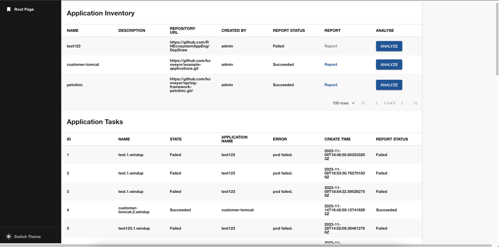

# MTA plugin for Backstage

The Migration Toolkit Applications(MTA) plugin displays the information about your application migration details in your Backstage application.



### Installation

1. Install the MTA plugin using the following command:

   ```console

   ```

### Configuration

To get the MTA token from a MTA installation that uses keycloak, run the following command for example:

```console
curl -k \
  -d "client_id=mta-ui" \
  -d "username=<username>" \
  -d 'password=<password>' \
  -d "grant_type=password" \
  "https://mta-openshift-mta.apps.rhdh-dev01.kni.syseng.devcluster.openshift.com/auth/realms/mta/protocol/openid-connect/token" | jq -r '.access_token'
```

1. Set the desired MTA server configuration in the `app-config.yaml` file as follows:

```

```

2. Enable an additional tab on the entity view page in `packages/app/src/components/catalog/EntityPage.tsx`:

   ```tsx title="packages/app/src/components/catalog/EntityPage.tsx"

   ```

3. Annotate your entity with the following annotations:

   ```yaml title="catalog-info.yaml"
   metadata:
     annotations:
       'mta.io/repository-slug': `<ORGANIZATION>/<REPOSITORY>',
   ```

## For users

### Using the Quay plugin in Backstage

MTA is a front-end plugin that enables you to view the information about the application migration.

#### Prerequisites

- Your Backstage application is installed and running.
- You have installed the MTA plugin. For installation process, see [Installation](#installation).

#### Procedure

1. Open your Backstage application and select a component from the **Catalog** page.
